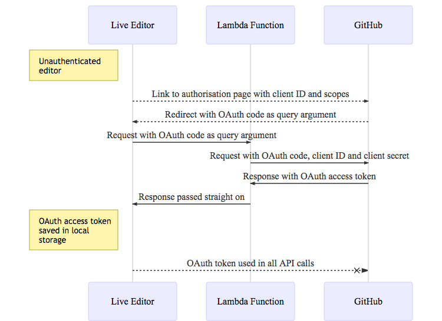

# Gist Integration

Being able to easily save and share programs is useful for collaboration. By integrating with GitHubs gists it becomes possible to load and save large pieces of work and to give others links to easily load them up in their own environment.

## Authentication

The major hurdle to use the GitHub API is authenticating with it. This requires a lot of moving parts unfortunately and configuration, but relatively little code. In this example the application is going to get an OAuth access token which will be used when making calls to save data as a gist.

It's necessary to have something that acts as a server back end to do this which doesn't work well when building a fully front end app in Javascript. Fortunately [netlify.com](https://netlify.com) offers a free tier of [AWS lambda function](https://www.netlify.com/docs/functions/) integration for which it's not necessary to have an Amazon Web Services account to use.

## Authentication Flow

Before getting to the nuts and bolts of setting things up, it would be useful to have a rough overview of what happens when the application actually gets an OAuth token. Firstly, it's necessary to register the OAuth application with GitHub in [the developer settings](https://github.com/settings/developers) to get the client ID and secret.
From within the app there should be a link to the OAuth authorisation endpoint `https://github.com/login/oauth/authorize` which passes the client ID and a list of requested permission scopes. When the user authorises the permissions, they will then be redirected back to the application with a code as a query argument in the URL. The application needs to exchange this code for an OAuth token.
To do this, the client side makes a request to a lambda function, which sends the code on to GitHub along with the client ID and secret. The response back contains the OAuth token.

The [GitHub Docs](https://developer.github.com/apps/building-oauth-apps/authorizing-oauth-apps/) are also worth reading for further explanation.

## Development Setup

The project uses Webpack to handle bundling and building the JavaScript, and the [netlify lambda](https://github.com/netlify/netlify-lambda) tool to allow serving function requests in local development.

[This article](https://macarthur.me/posts/building-a-lambda-function-with-netlify/) has a pretty good explanation on how to get much of that running.

## GitHub API

The [Github.js](http://github-tools.github.io/github/docs/3.1.0/index.html) library handles interaction with everything other than auth in the GitHub API.
